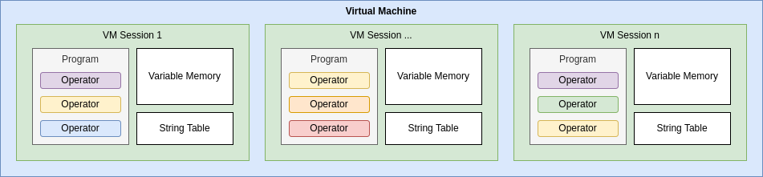

# BEAST - Binary Evolution And Sentience Toolkit

[](https://circleci.com/gh/dedicate-project/beast)
[](https://github.com/dedicate-project/beast/actions/workflows/codeql.yml)
[](https://ci.appveyor.com/project/fairlight1337/beast)
[](https://beast-project.readthedocs.io/en/latest/?badge=latest)
[](https://coveralls.io/github/dedicate-project/beast?branch=main)
[](https://sonarcloud.io/summary/new_code?id=dedicate-project_beast)
[](https://sonarcloud.io/summary/new_code?id=dedicate-project_beast)
[](https://sonarcloud.io/summary/new_code?id=dedicate-project_beast)
[](https://sonarcloud.io/summary/new_code?id=dedicate-project_beast)
[](https://www.gnu.org/licenses/gpl-3.0)


<p align="center">
 
</p>

## Synopsis

BEAST (Binary Evolution And Sentience Toolkit) is an open source project that defines and implements a virtual machine with a custom instruction set. The virtual machine operates on a byte level and supports all common low-level machine operations, but functions within an entirely virtual environment. This allows users to experiment with code transformations and custom low-level operators without the need for physical hardware.

One of the main goals of the BEAST project is to provide a platform for researchers and developers to explore the intersection of evolution and computation. The virtual machine's custom instruction set allows users to define their own low-level operators, enabling them to conduct experiments on how these operators impact the evolution and optimization of binary code.

In addition to its use as a research platform, the BEAST virtual machine also has practical applications in the field of computer science education. By providing a virtual environment for students to learn about low-level machine operations and experiment with code transformations, the BEAST project aims to give students a deeper understanding of how computers work at a fundamental level.

The BEAST virtual machine is implemented in a high-level programming language, making it easily accessible to a wide range of users. The project also includes extensive documentation and examples to help users get started with the virtual machine and begin exploring its capabilities.

Overall, the BEAST project provides a powerful and flexible platform for researchers and educators to explore the intersection of evolution and computation, and to gain a deeper understanding of low-level machine operations. By providing a virtual environment for experimentation and education, the BEAST project aims to advance the field of computer science and inspire the next generation of developers and researchers.

You can find the project's documentation [here](https://beast-project.readthedocs.io/en/latest/). The API documentation can be found [here](https://beast-project.readthedocs.io/en/latest/api.html). The current project roadmap can be found [here](https://github.com/dedicate-project/beast/blob/main/ROADMAP.md).

## Architecture

The BEAST system architecture is driven by three main elements: Virtual Machines (VMs), VM Sessions, and Programs. The following diagram shows how these relate to each other:



A Virtual Machine can be instantiated and be used with one or more VM Sessions. Each VM Session hosts one Program, alongside its state (which consists of a Variable Memory and a String Table). Each Program consists of zero or more operators. The size of a Program is virtually arbitrary (it must fit into the host's system memory).

The Variable Memory's layout is simple:
* It is defined to hold a maximum number of indexed variables of a fixed size of 8 bytes (internally managed as ``int32_t``).
* Variables can be either of type ``int32_t`` or of type ``link``. For ``int32_t`` variables, they store values directly. For ``link`` variables, when they are read, the read process is redirected to the memory address denoted by the stored value. Example:
  * Variable ``0`` of type ``int32_t`` has value ``128``.
  * Variable ``1`` of type ``link`` has value ``0``.
  * Reading variable ``1`` returns the value ``128``.
  * Setting variable ``1`` effectively sets the value of variable ``0``.
  * The redirection can be ignored for each call working with variables to be able to modify/read a link's redirection value.
* The number of supported variables is a property of the respective VmSession instance holding the Variable Memory.

The String Table's layout is also simple:
* It is defined to hold a maximum number of indexed strings of a maximum length.
* For each item, its size can be read.
* The number of supported string table entries and their maximum length are a property of the respective VmSession instance holding the table.


## A Simple Example

Writing BEAST programs is straight forward. Take the following "Hello World!" example:
```cpp
#include <iostream>

#include <beast/beast.hpp>

int main(int /*argc*/, char** /*argv*/) {
  // Define the program to run. This just sets a string table entry and prints it.
  beast::Program prg;
  prg.setStringTableEntry(0, "Hello World!");
  prg.printStringFromStringTable(0);

  // Define the VM session based on `prg`. It has space for 10 variables and can
  // store 5 string table entries, each being 25 characters long at most.
  beast::VmSession session(std::move(prg), 10, 5, 25);
  // This is the CPU based virtual machine to run the program/session in.
  beast::CpuVirtualMachine vm;

  // Run the program for as long as it runs.
  while (vm.step(session, false)) {
    // Send to output whatever the current step wants to print and clear the internal
    // buffer afterwards.
    std::cout << session.getPrintBuffer();
    session.clearPrintBuffer();
  }

  std::cout << std::endl;

  // Return the program's return (potentially error) code.
  return session.getReturnCode();
}
```

The program that is defined here stores the string "Hello World!" at string table index 0, and then
prints the string stored at string table index 0. The program is then executed in the CPU VM, the
result being that the following output appears on screen:
```bash
Hello World!
```

This could have been achieved in various ways (for exampe through printing individual variable
values), but this example shows the very bare basics of how to achieve a hello world example.


## Building

First, install the dependencies (assuming you're working on a Ubuntu system):
```bash
sudo apt install clang-tidy ccache
```

To build the project, check out the source code:
```bash
git clone https://github.com/dedicate-project/beast/
cd beast
git submodule update
```

Then, inside the repository, perform the following actions to actually build the code:
```bash
mkdir build
cd build
cmake ..
make
```

To speed up the build process, increase the number of processes used by the `make` command via `make
-j$(nproc)`.

To run all tests, afterwards run:
```bash
make test
```

To not build the tests (and save some time while developing or you just don't need them) you can disable them in CMake using this when configuring the build:
```bash
cmake -DBEAST_BUILD_TESTS=NO ..
```

If you want to create a coverage report, install these additional dependencies:
```bash
sudo apt install lcov npm
```

And run this:
```bash
mkdir build
cd build
cmake -DCMAKE_BUILD_TYPE=Debug ..
make
make coverage
```


## Defined Operators

Information about which operators are available (including a detailed description and a programming
interface reference) can be found in the [RTD Operators
section](https://beast-project.readthedocs.io/en/latest/operators.html).
